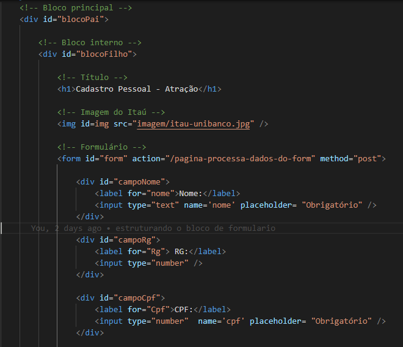
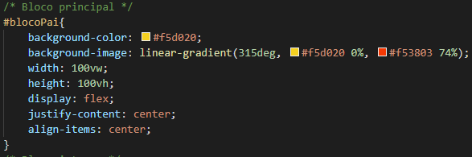
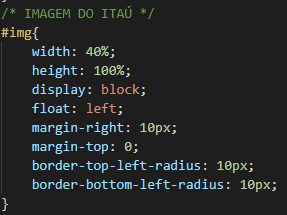
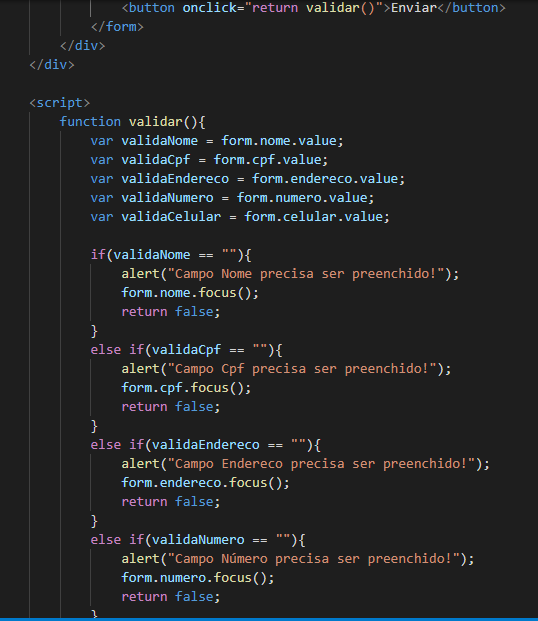

# Desafio Individual - Cadastro Pessoal
O projeto é um cadastro pessoal. O layout deste projeto foi inspirado pelo site de <b>TuCompra Payment</b>.

O projeto foi feito em <b>HTML, CSS e Javascript</b>.

Começando pelo <b>HTML</b>, há único arquivo com esse formato chamado index. 
No index, foi dividido em 2 blocos, sendo que bloco principal ocupa o layout inteiro e bloco interno ocupa dentro do bloco principal com objetivo de mostrar formulário e imagem do Itaú no mesmo bloco interno. Segue o anexo embaixo:

Agora no <b>CSS</b>, foi responsável por organizar o layout. 
Como tinha duas divisões principais do HTML (bloco principal e bloco interno) de forma ordenada e não mesclada, com CSS, foi possível mudar utilizando <b>display flex (Flexbox) </b> no bloco principal e configuramos a propriedade <b>justify-content</b> para disposição dos elementos internos (bloco interno) como centralizados na direção definida na propriedade anterior, ou seja, os itens ficarão no centro da linha horizontal e com a propriedade <b>align-items</b> definida como center, fazemos com que os elementos internos sejam também alinhados na vertical. Segue o anexo embaixo:
 
Com isso, tornou possível inserir bloco interno no bloco principal.

Agora no bloco interno, tem duas partes separadas: o lado esquerdo tem imagem do Itaú e o lado direito tem título e formulário. Para dar certo, foi utilizado a propriedade de <b>float</b> definida como <b>left</b> na imagem e facilitou o espaço deixado do resto do bloco interno para título e formulário do lado direito. Segue o anexo embaixo: 

Enfim, no <b>JAVASCRIPT</b>, foi trabalhado dentro do arquivo index com formato HTML.
Foi criada a função para validar os campos obrigatórios se estão vazios ou ocupados através da forma condicional. E depois botão do formulário quando clicar, chama a função criada pelo Javascript resolver a validação dos campos. Segue o anexo embaixo:

Com conclusão, o projeto foi um sucesso. CSS manipulou de várias maneiras o layout criado pelo HTML e Javascript cuidou dos campos para validação no formulário criado pelo HTML.

<h1>Referências</h1>

1 – <b>Como montar o formulário</b> - https://developer.mozilla.org/pt-BR/docs/Learn/Forms/Your_first_form

2 – <b>Colocar todos os estados do Brasil no formulário</b>  - https://gist.github.com/cassiocardoso/8966749

3 – <b>Como inserir bloco interno no bloco principal</b>  - https://www.devmedia.com.br/como-centralizar-divs-em-html-e-css/37568

4 – <b>Como diminuir o tamanho do input</b>  - https://forum.imasters.com.br/topic/425677-resolvido%C2%A0diminuir-tamanho-do-input-text/

5 – <b>Como fazer função do Javascript de validação dos campos</b>  – Material Complementar do Professor Ricardo via Slack.

6 – <b>Layout inspirado pelo site de TuCompra - https://colombia.recaudoexpress.com/recaudoExpress/login.xhtml;jsessionid=04ab286dd98081bd7a12bf0d5c0b
